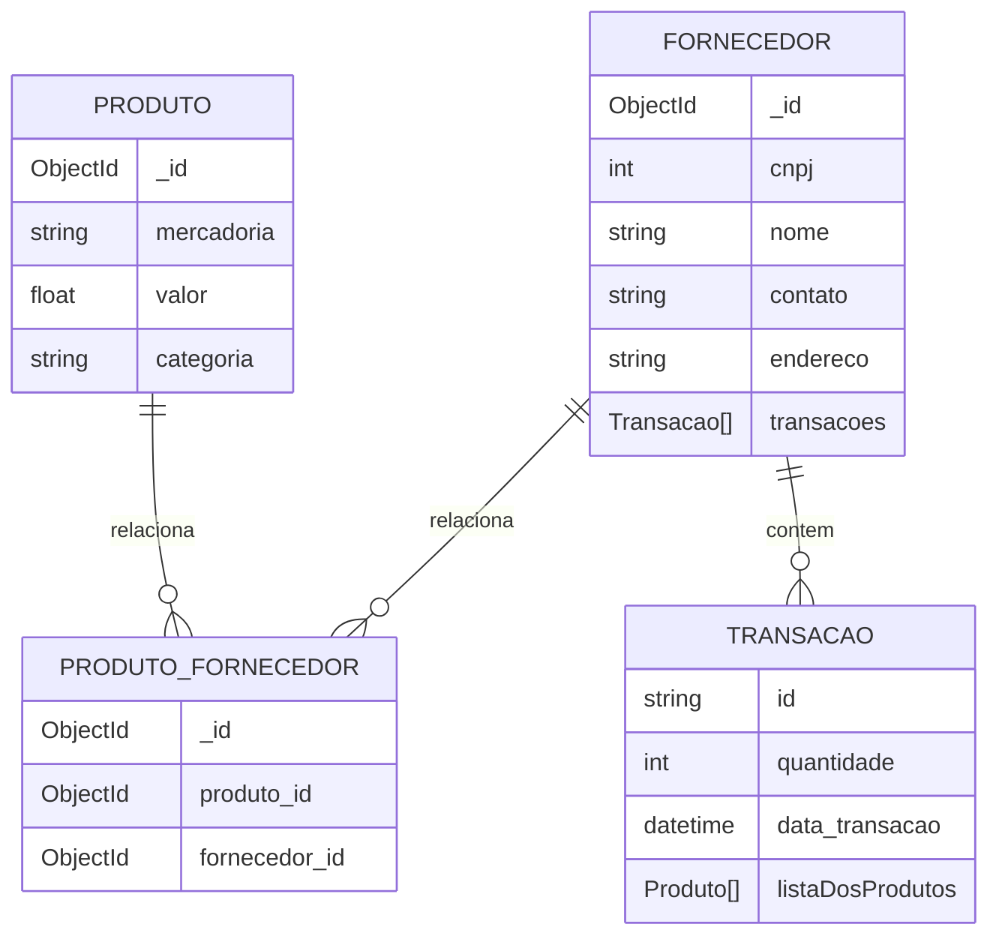

## Modelo de Dados

```mermaid
erDiagram
    PRODUTO {
        ObjectId _id
        string mercadoria
        float valor
        string categoria
    }

    FORNECEDOR {
        ObjectId _id
        int cnpj
        string nome
        string contato
        string endereco
        Transacao[] transacoes
    }

    PRODUTO_FORNECEDOR {
        ObjectId _id
        ObjectId produto_id
        ObjectId fornecedor_id
    }

    TRANSACAO {
        string id
        int quantidade
        datetime data_transacao
        Produto[] listaDosProdutos
    }

    PRODUTO ||--o{ PRODUTO_FORNECEDOR : relaciona
    FORNECEDOR ||--o{ PRODUTO_FORNECEDOR : relaciona
    FORNECEDOR ||--o{ TRANSACAO : contem
```
